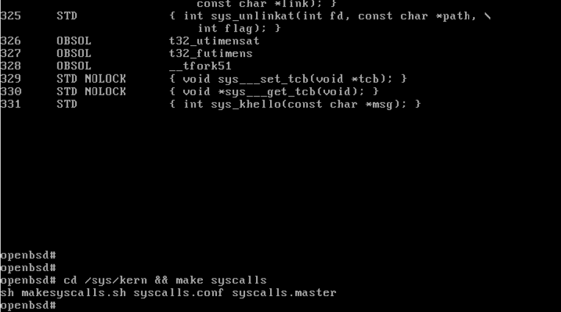
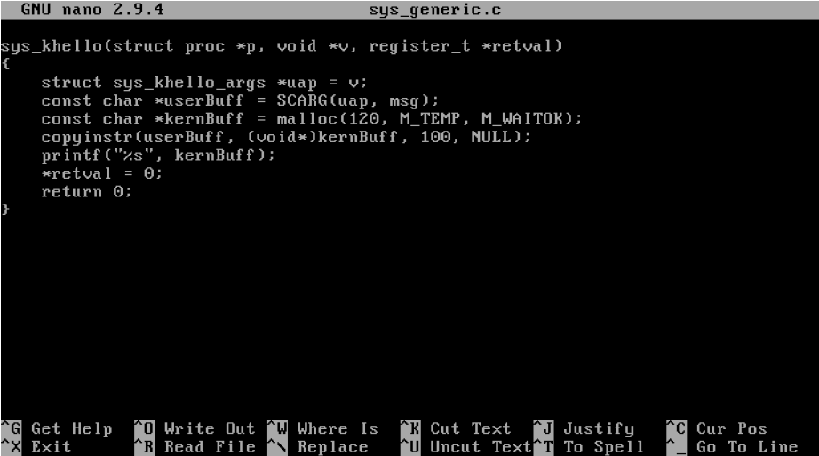
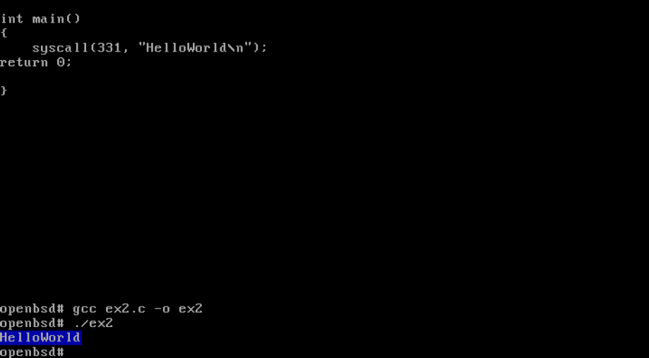

* Adaug la sfarsitul fisierului syscalls.master noua functie de sistem
    >  `cd /sys/kern`
    > 
    > `nano syscalls.master`
* Dupa modificarea syscalls.master, regenerez fisierele C 
    > `cd /sys/kern && make syscalls`

* Scriu definitia functiei de sistem in sys_generic.c
    > `cd /sys/kern/` 
    > 
    > `nano sys_generic.c` 

* Inainte de a apela functia trebuie sa recompilez kernel-ul

* Apelez functia cu `syscall(ID, nume_functie)`

✅ Output-ul este pe fond albastru, deci am resuit sa fac switch-ul de la user mode la kernel mode.

