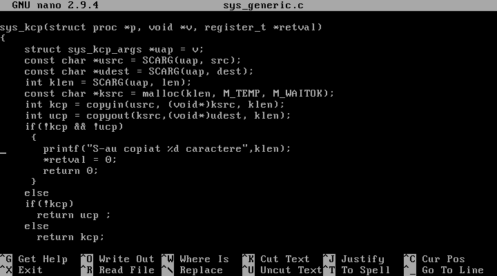
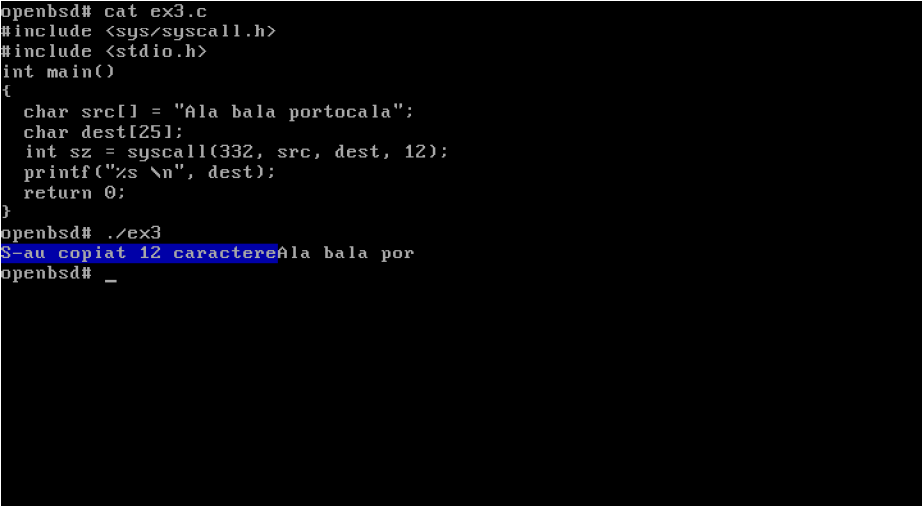

* Toti pasii sunt identici cu cei de la syscall-ul cu Hello World!
* Fisierul sys_generic.c arata asa:

:bangbang: Mai trebuie pus un int deasupra functiei (in screenshot nu a intrat)

* Rularea:

